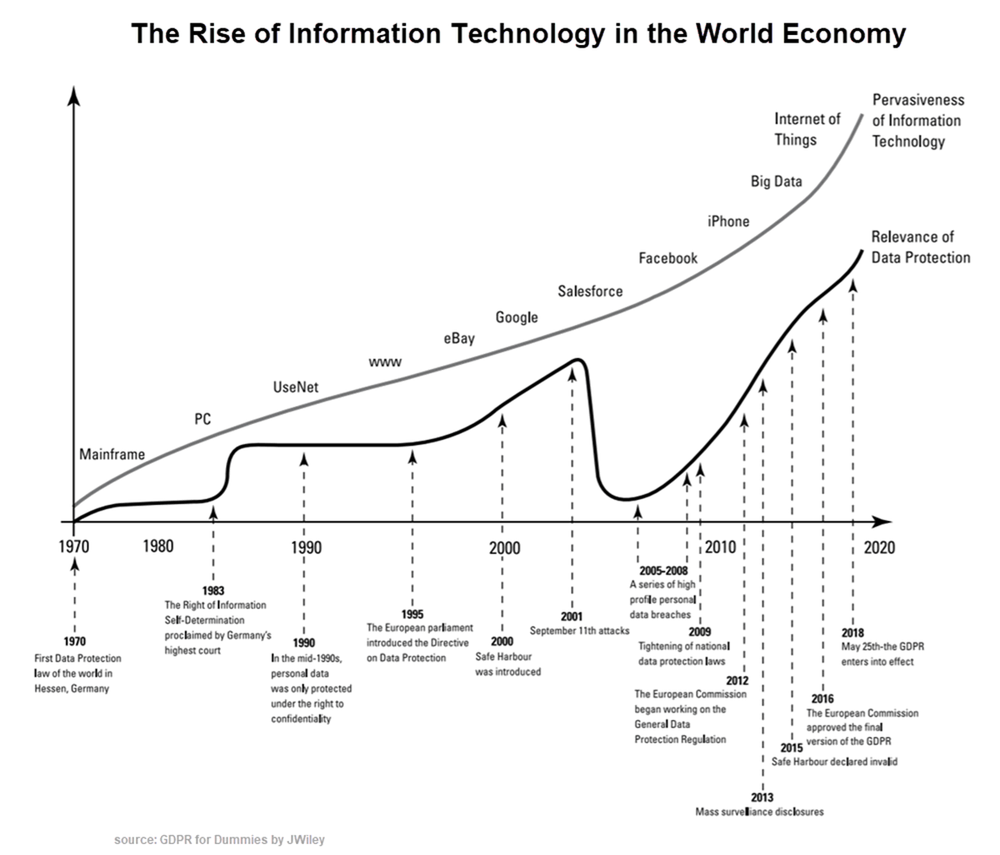
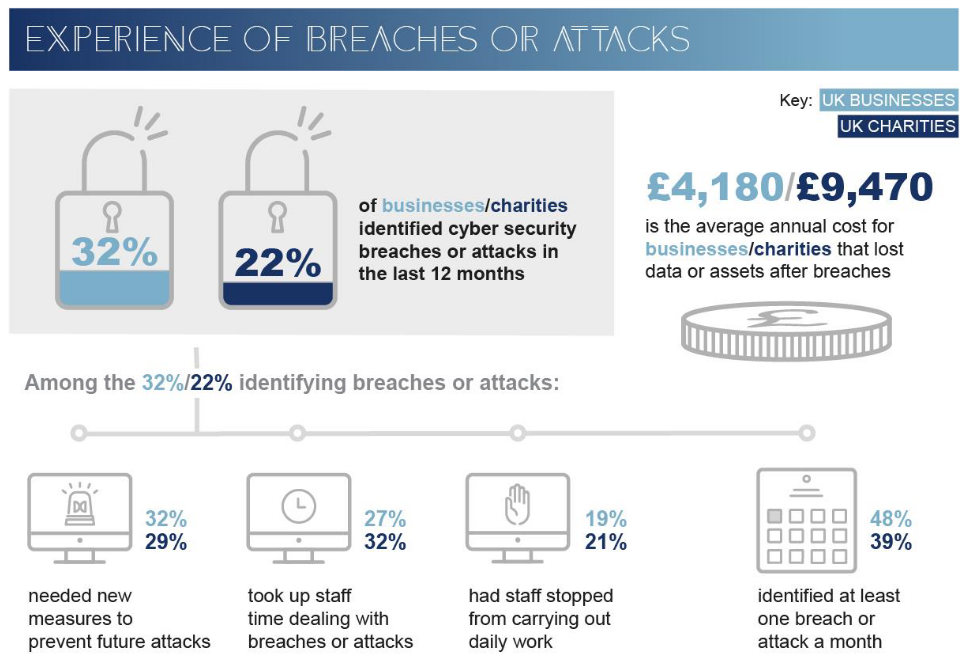
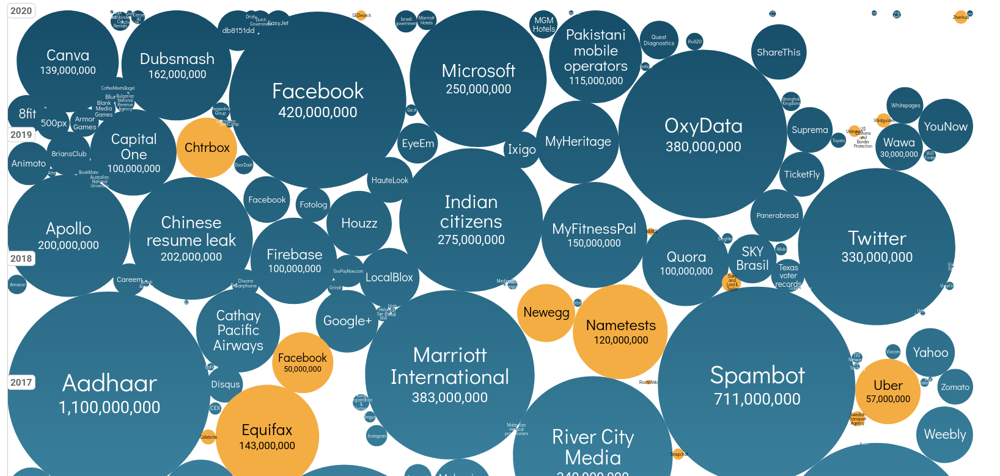
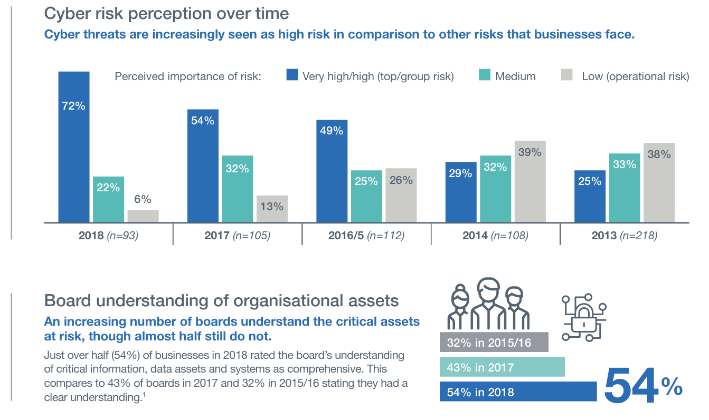
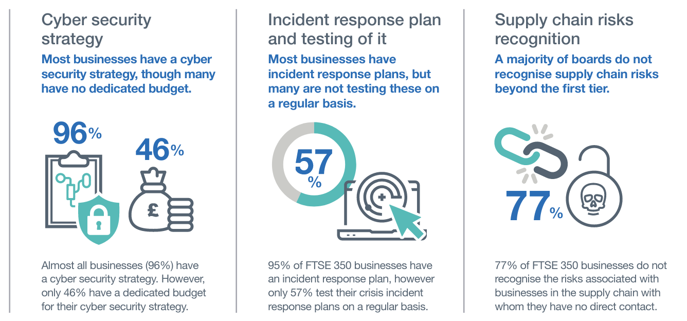
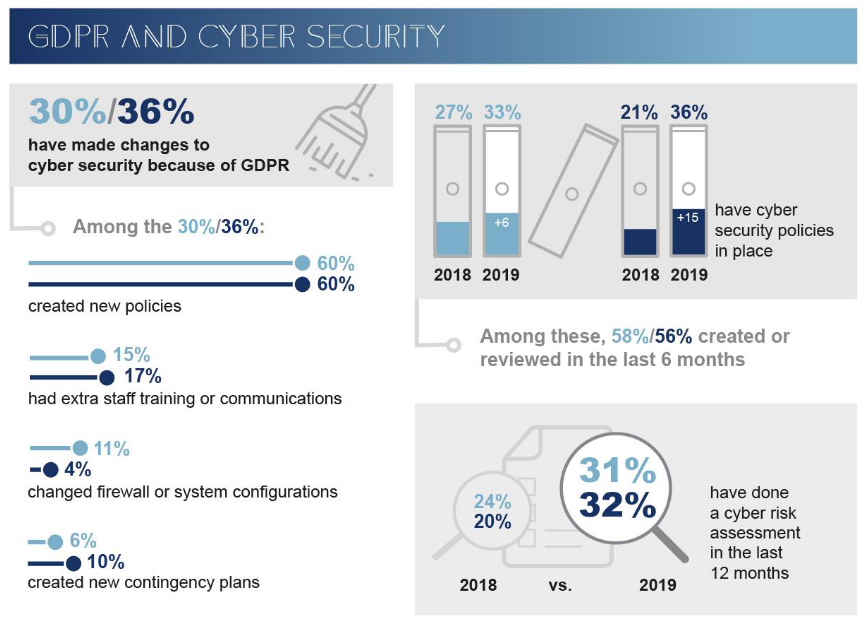
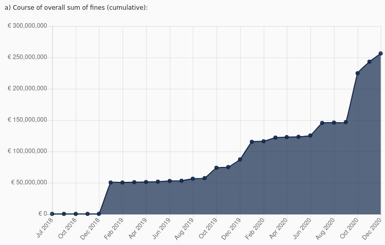
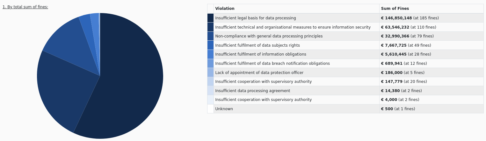
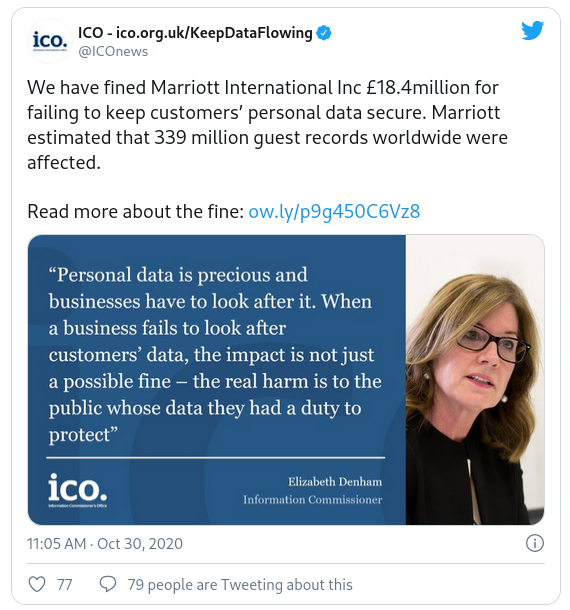

# Privacy and Data Protection

**ISAE-SUPAERO, SDD, January 2020**

Dennis WILSON

<!--s-->

## Overview and schedule

Schedule | | | |
--- | --- | --- | ---
[Data Protection](https://lms.isae.fr/mod/resource/view.php?id=57686) | 13/10/2021 | 3h | Carlos Melchor
[Business Intelligence](https://lms.isae.fr/mod/resource/view.php?id=62173) | 19/10/2021 20/10/2021 | 10h | Lionel Rigaud
**[Data Regulation](slides/enud_lecture.html)** | 09/11/2021 | 3h | Ronan Pons
[Mock trial](slides/enud_evaluation.html) | 16/11/2021 | 3h | Ronan Pons, Dennis Wilson

<!--s-->

## Right to personal data protection

Everyone has the right to:
+ the protection of personal data concerning him or her
+ access to data which has been collected concerning him or her, and the right to have it rectified

This right is enshrined in article 8 of the Charter of Fundamental Rights.

[source](https://ec.europa.eu/info/aid-development-cooperation-fundamental-rights/your-rights-eu/know-your-rights/freedoms/protection-personal-data_en)

<!--s-->

## History of European Data Protection

+ **1970s**, Europe: reaction to the rise of computers. existing law (including privacy law) would not be able to effectively protect individual rights from the risks brought about by the use of automated data processing systems.
+ **1980**, OECD Recommendations of the Council Concerning Guidelines Governing the Protection of Privacy and Trans-Border Flows of Personal Data
+ **January 28, 1981**, the Council opened for signature the ‘Convention for the Protection of Individuals with regard to Automated Processing of Personal Data’
  + control how computers are allowed to “think” about humans (what they can learn about us, what they must forget about us and when, for what purposes they can use what they know about us, what decisions they can make about us, and how they are supposed to explain all of that to us)
  + granted specific rights to individuals that could be exceeded against any entity that had control over the processing of personal data related to the individual.
+ **1995**, European Data Protection Directive, in effect until GDPR in 2018
+ **2012**, Workplan 29 Opinion on data protection reform proposal, leading to current GDPR

[History of the GDPR](https://edps.europa.eu/data-protection/data-protection/legislation/history-general-data-protection-regulation_en)

<!--s-->

## 1980: OECD

Organisation for Economic Co-operation and Development 

Recommendations of the Council Concerning Guidelines Governing the Protection of Privacy and Trans-Border Flows of Personal Data

+ **Notice**: data subjects should be given notice when their data is being collected;
+ **Purpose**: data should only be used for the purpose stated and not for any other purposes;
+ **Consent**: data should not be disclosed without the data subject’s consent;
+ **Security**: collected data should be kept secure from any potential abuses;
+ **Disclosure**: data subjects should be informed as to who is collecting their data;
+ **Access**: data subjects should be allowed to access their data and make corrections to any inaccurate data
+ **Accountability**: data subjects should have a method available to them to hold data collectors accountable for not following the above principles

<!--s-->

## History of Data Protection

<!--s-->

## The ongoing fight for Data Protection

Source:
[Cyber Security Breaches Survey 2019](https://www.gov.uk/government/statistics/cyber-security-breaches-survey-2019)

<!--s-->

## Data breaches

Source: [World's Biggest Data Breaches and Hacks](https://www.informationisbeautiful.net/visualizations/worlds-biggest-data-breaches-hacks/)

<!--s-->

## Security culture

Source: [FTSE 350 Cyber Governance Health Check Report 2018](https://www.gov.uk/government/publications/cyber-governance-health-check-2018)

<!--s-->

## Security culture

Source: [FTSE 350 Cyber Governance Health Check Report 2018](https://www.gov.uk/government/publications/cyber-governance-health-check-2018)

<!--s-->

## GDPR and Cyber Security

Source: [Cyber Security Breaches Survey 2019](https://www.gov.uk/government/statistics/cyber-security-breaches-survey-2019)

<!--s-->

## General Data Protection Regulation

RGPD: règlement général sur la protection des données

<iframe width="560" height="315" src="https://www.youtube.com/embed/u4M5lVYv3UI?start=30" frameborder="0" allow="accelerometer; autoplay; clipboard-write; encrypted-media; gyroscope; picture-in-picture" allowfullscreen></iframe>

<!--s-->

## General Data Protection Regulation

+ Requires companies and organisations to meet data protection requirements
+ Provides clear guidelines for data protection
+ Imposes fines on companies when data protection is breached
+ Enforces individuals' data protection rights

<!--s-->

## Personal data

**‘personal data’ means any information relating to an identified or identifiable natural person** (‘data subject’);

an identifiable natural person is one who can be identified, directly or indirectly, in particular by reference to an identifier such as a name, an identification number, location data, an online identifier or to one or more factors specific to the physical, physiological, genetic, mental, economic, cultural or social identity of that natural person.

[GDPR source](https://gdpr-info.eu/art-4-gdpr/)

<!--s-->

## Sensitive data

Data containing or revealing:
+ racial or ethnic origin
+ political opinions
+ religious or philosophical beliefs
+ trade union membership
+ genetic data
+ biometric data for the purpose of uniquely identifying a natural person
+ data concerning health 
+ data concerning a natural person’s sex life or sexual orientation

[GDPR source](https://gdpr-info.eu/art-4-gdpr/)

<!--s-->

## Who does the GDPR apply to?

+ Does the organization offer goods or services to EU residents?
+ Does the organization monitor the behaviour of EU residents such as apps and websites?
+ Does the organization have employees in the EU?

**Controller**:
    person, public authority, agency or other body which, alone or jointly with others, determines the purposes and means of processing of personal data

**Processor**:
    person, public authority, agency or other body which processes personal data on behalf of the controller

 
<!--s-->
   
## Data protection by design

Companies have a responsability to:
+ Develop IT systems, services, products and processes that involve processing personal data
+ Develop organisational policies, processes, business practices and/or strategies that have privacy implications

Privacy by design:
+ Differential privacy: how to safely share data
+ Homomorphic encryption: analysis on encrypted data
+ Tomorrow's class and spring Crypto in-depth

[GDPR, Article 25](https://gdpr-info.eu/art-25-gdpr/)
 
<!--s-->

## Data protection by default

Companies have a responsability to:
+ Only process the personal data that is necessary
+ Control and record data access
+ Ensure that personal data is not accessed without individual consent
+ Provide individuals with sufficient controls and options to exercise their rights

[GDPR, Article 25](https://gdpr-info.eu/art-25-gdpr/)
 
<!--s-->

## Enforcement

[source](https://www.enforcementtracker.com/)

<!--s-->

## Cause of fines

[source](https://www.enforcementtracker.com/)

<!--s-->

## Largest GDPR fine to date

50 million fine by CNIL against Google

+ [CNIL statement](https://www.cnil.fr/en/cnils-restricted-committee-imposes-financial-penalty-50-million-euros-against-google-llc)
+ [en français](https://www.cnil.fr/fr/le-conseil-detat-valide-la-sanction-prononcee-lencontre-de-la-societe-google-llc)
+ [dans les actualites](https://www.conseil-etat.fr/actualites/actualites/rgpd-le-conseil-d-etat-rejette-le-recours-dirige-contre-la-sanction-de-50-millions-d-euros-infligee-a-google-par-la-cnil)

**Exercise**

+ Who are the concerned parties in this case?
+ Which parts of the GDPR were violated?
+ What specific Google technologies were found in violation of the GDPR?

<!--s-->

## Marriott data breach

[ICO fines Marriott €20 million over data breach](https://ico.org.uk/about-the-ico/news-and-events/news-and-blogs/2020/10/ico-fines-marriott-international-inc-184million-for-failing-to-keep-customers-personal-data-secure/). Original fine was for €112 million, would have been largest case.

<!--s-->

## Data Protection outside of Europe

Long history in Europe of data protection law not present in many other countries.

Recent development in other countries, often based on or motivated by the GDPR:

+ South Korea, Personal Information Protection Act, in effect since 2011
+ Privacy Amendment (Notifiable Data Breaches) to Australia’s Privacy Act, February 2018
+ Brazil’s Lei Geral de Proteçao de Dados (LGPD), September 2020
+ Japan and European Commission's agreement on "reciprocal adequacy" of respective data protection laws
+ Chile's Constitution was amended to include data privacy as a human right, 2018

<!--s-->

## California Consumer Privacy Act

Grants California residents the rights to:
+ Know what personal data is being collected about them.
+ Know whether their personal data is sold or disclosed and to whom.
+ Say no to the sale of personal data.
+ Access their personal data.
+ Request a business to delete any personal information about a consumer collected from that consumer.
+ Not be discriminated against for exercising their privacy rights.

Enacted June 28, 2018, expanded by the California Privacy Rights Act of 2020.

[source](https://en.wikipedia.org/wiki/California_Consumer_Privacy_Act)

<!--s-->

## Illinois Biometric Information Privace Act

+ Obtain consent from individuals if the company intends to collect or disclose their personal biometric identifiers.
+ Destroy biometric identifiers in a timely manner.
+ Securely store biometric identifiers.

[BIPA source](https://en.wikipedia.org/wiki/Biometric_Information_Privacy_Act)

Facebook settles facial recognition case for $550 million. [source](https://www.business-humanrights.org/en/latest-news/facebook-to-pay-550-million-to-settle-privacy-lawsuit-over-facial-recognition-tech/)

<!--s-->

## Case study: Google de-linking 2019 case

What is the territorial scope of EU data protection law?

Google LLC v CNIL 2019 [EUECJ C-507/17](http://curia.europa.eu/juris/document/document.jsf?docid=218105&doclang=EN)

+ [Résumé CNIL](https://www.cnil.fr/fr/droit-au-dereferencement-la-cjue-rendu-ses-arrets)
+ [Blog français](https://association-idpa.com/blog-articles/2019/google-contre-cnil-portee-deferencement)
+ [Harvard Law blog post](https://jolt.law.harvard.edu/digest/google-v-cnil-eu-rules-that-right-to-be-forgotten-does-not-apply-globally)
+ [EU Law blog post](https://europeanlawblog.eu/2019/10/29/google-v-cnil-case-c-507-17-the-territorial-scope-of-the-right-to-be-forgotten-under-eu-law/)
+ [UK blog post](https://www.clydeco.com/en/insights/2020/01/reflecting-on-the-judgment-of-the-ecj-in-google-ll)

<!--s-->

## Case study: Google de-linking 2019 case

**Exercise**

+ What are the main claims being made in this case?
+ Who is making them?
+ What aspects of the GDPR does it rely on or challenge?
+ What decision was made?
